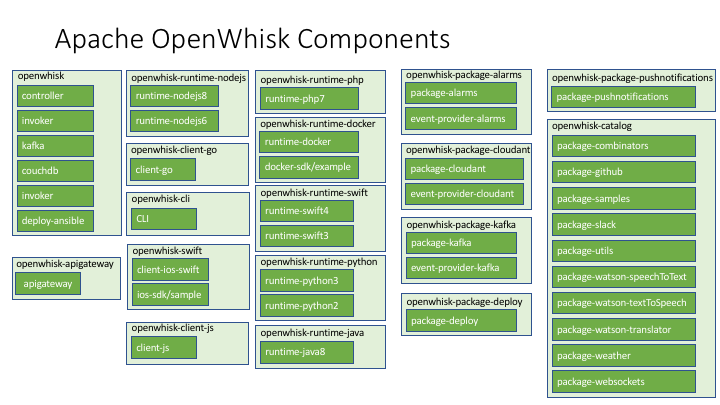

<!--
#
# Licensed to the Apache Software Foundation (ASF) under one or more
# contributor license agreements.  See the NOTICE file distributed with
# this work for additional information regarding copyright ownership.
# The ASF licenses this file to You under the Apache License, Version 2.0
# (the "License"); you may not use this file except in compliance with
# the License.  You may obtain a copy of the License at
#
#     http://www.apache.org/licenses/LICENSE-2.0
#
# Unless required by applicable law or agreed to in writing, software
# distributed under the License is distributed on an "AS IS" BASIS,
# WITHOUT WARRANTIES OR CONDITIONS OF ANY KIND, either express or implied.
# See the License for the specific language governing permissions and
# limitations under the License.
#
-->

# OpenWhisk

[](https://travis-ci.org/apache/openwhisk)
[](http://www.apache.org/licenses/LICENSE-2.0)
[](https://openwhisk-team.slack.com/)
[](https://codecov.io/gh/apache/openwhisk)
[](https://twitter.com/intent/follow?screen_name=openwhisk)

OpenWhisk is a serverless functions platform for building cloud applications.
OpenWhisk offers a rich programming model for creating serverless APIs from functions,
composing functions into serverless workflows, and connecting events to functions using rules and triggers.
Learn more at [http://openwhisk.apache.org](http://openwhisk.apache.org).

* [Quick Start](#quick-start) (Deploy and Use OpenWhisk on your machine)
* [Deploy to Kubernetes](#deploy-to-kubernetes) (For development and production)
* For project contributors and Docker deployments:
  * [Deploy to Docker for Mac](./tools/macos/README.md)
  * [Deploy to Docker for Ubuntu](./tools/ubuntu-setup/README.md)
* [Learn Concepts and Commands](#learn-concepts-and-commands)
* [OpenWhisk Community and Support](#openwhisk-community-and-support)
* [Project Repository Structure](#project-repository-structure)

### Quick Start

The easiest way to start using OpenWhisk is to install the "Standalone" OpenWhisk stack.
This is a full-featured OpenWhisk stack running as a Java process for convenience.
Serverless functions run within Docker containers. You will need [Docker](https://docs.docker.com/install),
[Java](https://java.com/en/download/help/download_options.xml) and [Node.js](https://nodejs.org) available on your machine.

To get started:
```
git clone https://github.com/apache/openwhisk.git
cd openwhisk
./gradlew core:standalone:bootRun
```

- When the OpenWhisk stack is up, it will open your browser to a functions [Playground](./docs/images/playground-ui.png),
typically served from http://localhost:3232. The Playground allows you create and run functions directly from your browser.

- To make use of all OpenWhisk features, you will need the OpenWhisk command line tool called
`wsk` which you can download from https://s.apache.org/openwhisk-cli-download.
Please refer to the [CLI configuration](./docs/cli.md) for additional details. Typically you
configure the CLI for Standalone OpenWhisk as follows:
```
wsk property set \
  --apihost 'http://localhost:3233' \
  --auth '23bc46b1-71f6-4ed5-8c54-816aa4f8c502:123zO3xZCLrMN6v2BKK1dXYFpXlPkccOFqm12CdAsMgRU4VrNZ9lyGVCGuMDGIwP'
```

- Standalone OpenWhisk can be configured to deploy additional capabilities when that is desirable.
Additional resources are available [here](./core/standalone/README.md).

### Deploy to Kubernetes

OpenWhisk can also be installed on a Kubernetes cluster. You can use
a managed Kubernetes cluster provisioned from a public cloud provider
(e.g., AKS, EKS, IKS, GKE), or a cluster you manage yourself.
Additionally for local development, OpenWhisk is compatible with Minikube,
and Kubernetes for Mac using the support built into Docker 18.06 (or higher).

To get started:

```
git clone https://github.com/apache/openwhisk-deploy-kube.git
```

Then follow the instructions in the [OpenWhisk on Kubernetes README.md](https://github.com/apache/openwhisk-deploy-kube/blob/master/README.md).

### Learn Concepts and Commands

Browse the [documentation](docs/) to learn more. Here are some topics you may be
interested in:

- [System overview](docs/about.md)
- [Getting Started](docs/README.md)
- [Create and invoke actions](docs/actions.md)
- [Create triggers and rules](docs/triggers_rules.md)
- [Use and create packages](docs/packages.md)
- [Browse and use the catalog](docs/catalog.md)
- [OpenWhisk system details](docs/reference.md)
- [Implementing feeds](docs/feeds.md)
- [Developing a runtime for a new language](docs/actions-actionloop.md)

### OpenWhisk Community and Support

Report bugs, ask questions and request features [here on GitHub](../../issues).

You can also join the OpenWhisk Team on Slack [https://openwhisk-team.slack.com](https://openwhisk-team.slack.com) and chat with developers. To get access to our public Slack team, request an invite [https://openwhisk.apache.org/slack.html](https://openwhisk.apache.org/slack.html).

### Project Repository Structure

The OpenWhisk system is built from a [number of components](docs/dev/modules.md).  The picture below groups the components by their GitHub repos. Please open issues for a component against the appropriate repo (if in doubt just open against the main openwhisk repo).


