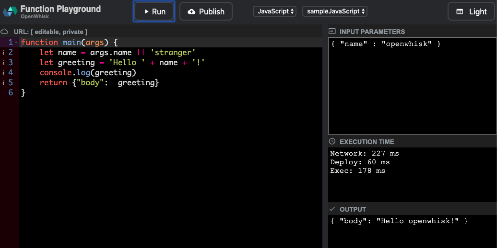

<!--
#
# Licensed to the Apache Software Foundation (ASF) under one or more
# contributor license agreements.  See the NOTICE file distributed with
# this work for additional information regarding copyright ownership.
# The ASF licenses this file to You under the Apache License, Version 2.0
# (the "License"); you may not use this file except in compliance with
# the License.  You may obtain a copy of the License at
#
#     http://www.apache.org/licenses/LICENSE-2.0
#
# Unless required by applicable law or agreed to in writing, software
# distributed under the License is distributed on an "AS IS" BASIS,
# WITHOUT WARRANTIES OR CONDITIONS OF ANY KIND, either express or implied.
# See the License for the specific language governing permissions and
# limitations under the License.
#
-->

# OpenWhisk Standalone Server

OpenWhisk standalone server is meant to run a simple OpenWhisk server for local development and test purposes. It can be
executed as a normal java application from command line.

```bash
java -jar openwhisk-standalone.jar
```

This should start the OpenWhisk server on port 3233 by default and launch a Playground UI at port 3232.



The Playground UI can be used to try out simple actions. To make use of all OpenWhisk features [configure the cli][1] and
then try out the [samples][2].

This server by default uses a memory based store and does not depend on any other external service like Kafka and CouchDB.
It only needs Docker and Java to for running.

Few key points related to it

* Uses in memory store. Once the server is stopped all changes would be lost
* Bootstraps the `guest` and `whisk.system` with default keys
* Supports running on MacOS, Linux and Windows (experimental) setup
* Can be customized to use any other storage like CouchDB


### Build

To build this standalone server run

```bash
$ ./gradlew :core:standalone:build
```

This would create the runnable jar in `bin/` directory. If you directly want to run the
server then you can use following command

```bash
$ ./gradlew :core:standalone:bootRun
```

To pass argument to the run command use

```bash
$ ./gradlew :core:standalone:bootRun --args='-m runtimes.json'
```

You can also build a standalone docker image with:

```bash
$ ./gradlew :core:standalone:distDocker
```

###  Usage

OpenWhisk standalone server support various launch options

```
$ java -jar openwhisk-standalone.jar -h


       /\   \    / _ \ _ __   ___ _ __ | |  | | |__ (_)___| | __
  /\  /__\   \  | | | | '_ \ / _ \ '_ \| |  | | '_ \| / __| |/ /
 /  \____ \  /  | |_| | |_) |  __/ | | | |/\| | | | | \__ \   <
 \   \  /  \/    \___/| .__/ \___|_| |_|__/\__|_| |_|_|___/_|\_\
  \___\/ tm           |_|

  -m, --manifest  <arg>               Manifest JSON defining the supported
                                      runtimes
  -c, --config-file  <arg>            application.conf which overrides the
                                      default standalone.conf
      --api-gw                        Enable API Gateway support
      --couchdb                       Enable CouchDB support
      --user-events                   Enable User Events along with Prometheus
                                      and Grafana
      --kafka                         Enable embedded Kafka support
      --kafka-ui                      Enable Kafka UI

      --all                           Enables all the optional services
                                      supported by Standalone OpenWhisk like
                                      CouchDB, Kafka etc
      --api-gw-port  <arg>            API Gateway Port
      --clean                         Clean any existing state like database
  -d, --data-dir  <arg>               Directory used for storage
      --dev-kcf                       Enables KubernetesContainerFactory for
                                      local development
      --dev-mode                      Developer mode speeds up the startup by
                                      disabling preflight checks and avoiding
                                      explicit pulls.
      --dev-user-events-port  <arg>   Specify the port for the user-event
                                      service. This mode can be used for local
                                      development of user-event service by
                                      configuring Prometheus to connect to
                                      existing running service instance
      --disable-color-logging         Disables colored logging
      --enable-bootstrap              Enable bootstrap of default users and
                                      actions like those needed for Api Gateway
                                      or Playground UI. By default bootstrap is
                                      done by default when using Memory store or
                                      default CouchDB support. When using other
                                      stores enable this flag to get bootstrap
                                      done
      --kafka-docker-port  <arg>      Kafka port for use by docker based
                                      services. If not specified then 9091 or
                                      some random free port (if 9091 is busy)
                                      would be used
      --kafka-port  <arg>             Kafka port. If not specified then 9092 or
                                      some random free port (if 9092 is busy)
                                      would be used
      --no-ui                         Disable Playground UI
      --ui-port  <arg>                Playground UI server port. If not specified
                                      then 3232 or some random free port (if
                                      org.apache.openwhisk.standalone.StandaloneOpenWhisk$@75a1cd57
                                      is busy) would be used
  -p, --port  <arg>                   Server port
  -v, --verbose
      --zk-port  <arg>                Zookeeper port. If not specified then 2181
                                      or some random free port (if 2181 is busy)
                                      would be used
  -h, --help                          Show help message
      --version                       Show version of this program

OpenWhisk standalone server

```

Sections below would illustrate some of the supported options

To change the default config you can provide a custom `application.conf` file via `-c` option. The application conf file
must always include the default `standalone.conf`

```hocon
include classpath("standalone.conf")

whisk {
  //Custom config
}
```

Then pass this config file

```bash
java -jar openwhisk-standalone.jar -c custom.conf
```

#### Adding custom namespaces

If you need to register custom namespaces (aka users) then you can pass them via config file like below

```hocon
include classpath("standalone.conf")

whisk {
  users {
    whisk-test = "cafebabe-cafe-babe-cafe-babecafebabe:007zO3xZCLrMN6v2BKK1dXYFpXlPkccOFqm12CdAsMgRU4VrNZ9lyGVCGuMDGIwP"
  }
}
```

Then pass this config file via `-c` option. You can check the users created from log

```
[2019-06-21T19:52:02.923Z] [INFO] [#tid_userBootstrap] [StandaloneOpenWhisk] Created user [guest]
[2019-06-21T19:52:03.008Z] [INFO] [#tid_userBootstrap] [StandaloneOpenWhisk] Created user [whisk.system]
[2019-06-21T19:52:03.094Z] [INFO] [#tid_userBootstrap] [StandaloneOpenWhisk] Created user [whisk.test]
```

#### Using custom runtimes

To use custom runtime pass the runtime manifest via `-m` option

```json
{
  "runtimes": {
    "ruby": [
      {
        "kind": "ruby:2.5",
        "default": true,
        "deprecated": false,
        "attached": {
          "attachmentName": "codefile",
          "attachmentType": "text/plain"
        },
        "image": {
          "prefix": "openwhisk",
          "name": "action-ruby-v2.5",
          "tag": "latest"
        }
      }
    ]
  }
}
```

The pass this file at launch time

```bash
java -jar openwhisk-standalone.jar -m custom-runtime.json
```

You can then see the runtime config reflect in `http://localhost:3233`

#### Using CouchDB

If you need to use CouchDB then you can launch the standalone server with `--couchdb` option. This would launch
a CouchDB server which would configured to store files in user home directory under `.openwhisk/standalone` folder.

If you need to connect to external CouchDB or any other supported artifact store then you can pass the required config

```hocon
include classpath("standalone.conf")

whisk {
  couchdb {
    protocol = "http"
    host = "172.17.0.1"
    port = "5984"
    username = "whisk_admin"
    password = "some_passw0rd"
    provider = "CouchDB"
    databases {
      WhiskAuth = "whisk_local_subjects"
      WhiskEntity = "whisk_local_whisks"
      WhiskActivation = "whisk_local_activations"
    }
  }
}
```

Then pass this config file via `-c` option.

Note that Standalone OpenWhisk will not bootstrap users and actions (e.g., API Gateway and Playground UI)
when using an external database unless explicitly requested with `--enable-bootstrap`. This is to ensure
that default users and actions are not added to your external artifact store.

#### Using API Gateway

API Gateway mode can be enabled via `--api-gw` flag. In this mode upon launch a separate container for [OpenWhisk API gateway][3]
would be launched on port `3234` (can be changed with `--api-gw-port`). In this mode you can make use of the
[API Gateway][4] support.

#### Using Kafka

Standalone OpenWhisk supports launching an [embedded kafka][5]. This mode is mostly useful for developers working on OpenWhisk
implementation itself.

```
java -jar openwhisk-standalone.jar --kafka
```

It also supports launching a Kafka UI based on [Kafdrop 3][6] which enables seeing the topics created and structure of messages
exchanged on those topics.

```
java -jar openwhisk-standalone.jar --kafka --kafka-ui
```

By default the ui server would be accessible at http://localhost:9000. In case 9000 port is busy then a random port would
be selected. To find out the port look for message in log like below (or grep for `whisk-kafka-drop-ui`)

```
[ 9092  ] localhost:9092 (kafka)
[ 9092  ] 192.168.65.2:9091 (kafka-docker)
[ 2181  ] Zookeeper (zookeeper)
[ 9000  ] http://localhost:9000 (whisk-kafka-drop-ui)
```

#### User Events

Standalone OpenWhisk supports emitting [user events][7] and displaying them via Grafana Dashboard. The metrics are
consumed by [User Event Service][8] which converts them into metrics consumed via Prometheus.

```
java -jar openwhisk-standalone.jar --user-events
```

This mode would launch an embedded Kafka, User Event service, Prometheus and Grafana with preconfigured dashboards.

```
Launched service details

[ 9092  ] localhost:9092 (kafka)
[ 9091  ] 192.168.65.2:9091 (kafka-docker)
[ 2181  ] Zookeeper (zookeeper)
[ 3235  ] http://localhost:3235 (whisk-user-events)
[ 9090  ] http://localhost:9090 (whisk-prometheus)
[ 3000  ] http://localhost:3000 (whisk-grafana)
```

#### Using KubernetesContainerFactory

Standalone OpenWhisk can be configured to use KubernetesContainerFactory (KCF) via `--dev-kcf` option. This mode can be used to
simplify developing KubernetesContainerFactory.

Below mentioned steps are based on [Kind][9] tool for running local Kubernetes clusters using Docker container "nodes".
However this mode should work against any Kubernetes cluster if the the `KUBECONFIG` is properly set.

##### 1. Install and configure Kind

We would use Kind to setup a local k8s. Follow the steps [here][10] to create a simple cluster.

```bash
$ kind create cluster --wait 5m

# Export the kind config for kubectl usage
$ export KUBECONFIG="$(kind get kubeconfig-path)"

# Configure the default namespace
$ kubectl config set-context --current --namespace=default

# See the config path
$ kind get kubeconfig-path
/Users/example/.kube/kind-config-kind
```

##### 2. Launch Standalone

```bash
# Launch it with `kubeconfig` system property set to kind config
$ java  -Dkubeconfig="$(kind get kubeconfig-path)" -jar bin/openwhisk-standalone.jar --dev-kcf
```

Once started and required `.wskprops` configured to use the standalone server create a `hello.js` function

```js
function main(params) {
    greeting = 'hello, world'
    var hello = {payload: greeting}
    var result = {...hello, ...process.env}
    console.log(greeting);
    return result
}
```

```bash
$ wsk action create hello hello.js
$ wsk action invoke hello -br
```

This shows an output like below indicating that KubernetesContainerFactory based invocation is working properly.

```
{
    "HOME": "/root",
    "HOSTNAME": "wsk0-2-prewarm-nodejs10",
    "KUBERNETES_PORT": "tcp://10.96.0.1:443",
    "KUBERNETES_PORT_443_TCP": "tcp://10.96.0.1:443",
    "KUBERNETES_PORT_443_TCP_ADDR": "10.96.0.1",
    "KUBERNETES_PORT_443_TCP_PORT": "443",
    "KUBERNETES_PORT_443_TCP_PROTO": "tcp",
    "KUBERNETES_SERVICE_HOST": "10.96.0.1",
    "KUBERNETES_SERVICE_PORT": "443",
    "KUBERNETES_SERVICE_PORT_HTTPS": "443",
    "NODE_VERSION": "10.15.3",
    "PATH": "/usr/local/sbin:/usr/local/bin:/usr/sbin:/usr/bin:/sbin:/bin",
    "PWD": "/nodejsAction",
    "YARN_VERSION": "1.13.0",
    "__OW_ACTION_NAME": "/guest/hello",
    "__OW_ACTION_VERSION": "0.0.1",
    "__OW_ACTIVATION_ID": "71e48d2d62e142eca48d2d62e192ec2d",
    "__OW_API_HOST": "http://host.docker.internal:3233",
    "__OW_DEADLINE": "1570223213407",
    "__OW_NAMESPACE": "guest",
    "__OW_TRANSACTION_ID": "iSOoNklk6V7l7eh8KJnvugidKEmaNJmv",
    "payload": "hello, world"
}
```

## Launching OpenWhisk standalone with Docker

If you have docker and bash installed, you can launch the standalone openwhisk from the docker image with just:

`bash <(curl -sL https://s.apache.org/openwhisk.sh)`

The script will start the standalone controller with Docker, and will also try to open the playground. It was tested on Linux, OSX and Windows with Git Bash. If a browser does not automatically open the OpenWhisk playground, you can access it at `http://localhost:3232`.

The default standalone controller image is published as `openwhisk/standalone:nightly` for convenience.

You can specify a different image to this script and also pass additional parameters to Docker. The general format is:

`bash <(curl -sL https://s.apache.org/openwhisk.sh) [<image-name>] [<additional-docker-parameters>...]`

If you do not want to execute arbitrary code straight from the net, you can look at [this script](start.sh), check it and run it when you feel safe.

If the playground is not enough, you can then install the [wsk CLI](https://github.com/apache/openwhisk-cli/releases) and retrieve the command line to configure `wsk` with:

`docker logs openwhisk | grep 'wsk property'`

To properly shut down OpenWhisk and any additional containers it has created, use [this script](stop.sh) or run the command:

`docker exec openwhisk stop`

### Extra Args for the Standalone OpenWhisk Docker Image

When running OpenWhisk Standalone using the docker image,  you can set environment variables to pass extra args with the `-e` flag.

Extra args are useful to configure the JVM running OpenWhisk and to propagate additional environment variables to containers running images. This feature is useful for example to enable debugging for actions.

You can pass additional parameters (for example set system properties) to the JVM running OpenWhisk setting the environment variable `JVM_EXTRA_ARGS`. For example `-e JVM_EXTRA_ARGS=-Dconfig.loads` allows to enable tracing of configuration. You can set any OpenWhisk parameter with feature.

You can also set additional environment variables for each container running actions invoked by OpenWhisk by setting `CONTAINER_EXTRA_ENV`. For example, setting `-e CONTAINER_EXTRA_ENV=__OW_DEBUG_PORT=8081` enables debugging for those images supporting starting the action under a debugger, like the typescript runtime.

[1]: https://github.com/apache/openwhisk/blob/master/docs/cli.md
[2]: https://github.com/apache/openwhisk/blob/master/docs/samples.md
[3]: https://github.com/apache/openwhisk-apigateway
[4]: https://github.com/apache/openwhisk/blob/master/docs/apigateway.md
[5]: https://github.com/embeddedkafka/embedded-kafka
[6]: https://github.com/obsidiandynamics/kafdrop
[7]: https://github.com/apache/openwhisk/blob/master/docs/metrics.md#user-specific-metrics
[8]: https://github.com/apache/openwhisk/blob/master/core/monitoring/user-events/README.md
[9]: https://kind.sigs.k8s.io/
[10]: https://kind.sigs.k8s.io/docs/user/quick-start/
