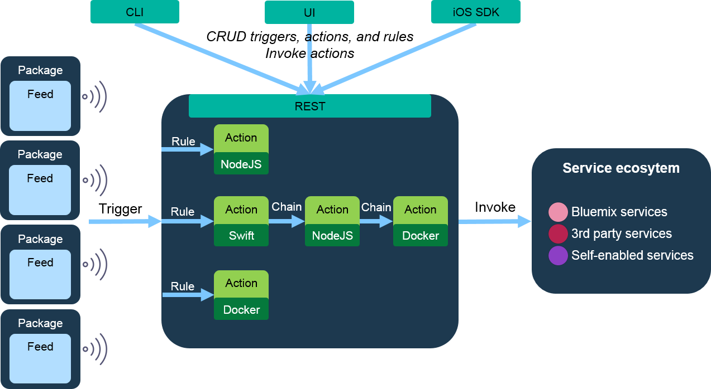
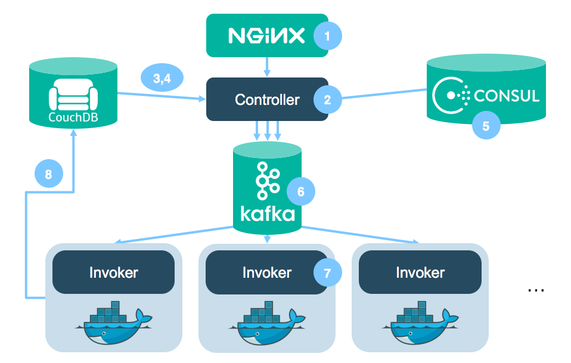

<!--
#
# Licensed to the Apache Software Foundation (ASF) under one or more
# contributor license agreements.  See the NOTICE file distributed with
# this work for additional information regarding copyright ownership.
# The ASF licenses this file to You under the Apache License, Version 2.0
# (the "License"); you may not use this file except in compliance with
# the License.  You may obtain a copy of the License at
#
#     http://www.apache.org/licenses/LICENSE-2.0
#
# Unless required by applicable law or agreed to in writing, software
# distributed under the License is distributed on an "AS IS" BASIS,
# WITHOUT WARRANTIES OR CONDITIONS OF ANY KIND, either express or implied.
# See the License for the specific language governing permissions and
# limitations under the License.
#
-->
# System overview

OpenWhisk is an event-driven compute platform also referred to as Serverless computing or as Function as a Service (FaaS) that runs code in response to events or direct invocations. The following figure shows the high-level OpenWhisk architecture.



Examples of events include changes to database records, IoT sensor readings that exceed a certain temperature, new code commits to a GitHub repository, or simple HTTP requests from web or mobile apps. Events from external and internal event sources are channeled through a trigger, and rules allow actions to react to these events.

Actions can be small snippets of code (JavaScript, Swift and many other languages are supported), or custom binary code embedded in a Docker container. Actions in OpenWhisk are instantly deployed and executed whenever a trigger fires. The more triggers fire, the more actions get invoked. If no trigger fires, no action code is running, so there is no cost.

In addition to associating actions with triggers, it is possible to directly invoke an action by using the OpenWhisk API, CLI, or iOS SDK. A set of actions can also be chained without having to write any code. Each action in the chain is invoked in sequence with the output of one action passed as input to the next in the sequence.

With traditional long-running virtual machines or containers, it is common practice to deploy multiple VMs or containers to be resilient against outages of a single instance. However, OpenWhisk offers an alternative model with no resiliency-related cost overhead. The on-demand execution of actions provides inherent scalability and optimal utilization as the number of running actions always matches the trigger rate. Additionally, the developer now only focuses on code and does not worry about monitoring, patching, and securing the underlying server, storage, network, and operating system infrastructure.

Integrations with additional services and event providers can be added with packages. A package is a bundle of feeds and actions. A feed is a piece of code that configures an external event source to fire trigger events. For example, a trigger that is created with a Cloudant change feed will configure a service to fire the trigger every time a document is modified or added to a Cloudant database. Actions in packages represent reusable logic that a service provider can make available so that developers not only can use the service as an event source, but also can invoke APIs of that service.

An existing catalog of packages offers a quick way to enhance applications with useful capabilities, and to access external services in the ecosystem. Examples of external services that are OpenWhisk-enabled include Cloudant, The Weather Company, Slack, and GitHub.

# How OpenWhisk works

Being an open-source project, OpenWhisk stands on the shoulders of giants, including Nginx, Kafka, Docker, CouchDB. All of these components come together to form a “serverless event-based programming service”. To explain all the components in more detail, lets trace an invocation of an action through the system as it happens. An invocation in OpenWhisk is the core thing a serverless-engine does: Execute the code the user has fed into the system and return the results of that execution.

## Creating the action

To give the explanation a little bit of context, let’s create an action in the system first. We will use that action to explain the concepts later on while tracing through the system. The following commands assume that the [OpenWhisk CLI is setup properly](https://github.com/apache/openwhisk/blob/master/docs/cli.md).

First, we’ll create a file *action.js* containing the following code which will print “Hello World” to stdout and return a JSON object containing “world” under the key “hello”.
```
function main() {
    console.log('Hello World');
    return { hello: 'world' };
}
```
We create that action using.
```
wsk action create myAction action.js
```
Done. Now we actually want to invoke that action:
```
wsk action invoke myAction --result
```

## The internal flow of processing
What actually happens behind the scenes in OpenWhisk?



### Entering the system: nginx

First: OpenWhisk’s user-facing API is completely HTTP based and follows a RESTful design. As a consequence, the command sent via the `wsk` CLI is essentially an HTTP request against the OpenWhisk system. The specific command above translates roughly to:
```
POST /api/v1/namespaces/$userNamespace/actions/myAction
Host: $openwhiskEndpoint
```

Note the *$userNamespace* variable here. A user has access to at least one namespace. For simplicity, let’s assume that the user owns the namespace where *myAction* is put into.

The first entry point into the system is through **nginx**, “an HTTP and reverse proxy server”. It is mainly used for SSL termination and forwarding appropriate HTTP calls to the next component.

### Entering the system: Controller

Not having done much to our HTTP request, nginx forwards it to the **Controller**, the next component on our trip through OpenWhisk. It is a Scala-based implementation of the actual REST API (based on **Akka** and **Spray**) and thus serves as the interface for everything a user can do, including [CRUD](https://en.wikipedia.org/wiki/Create,_read,_update_and_delete) requests for your entities in OpenWhisk and invocation of actions (which is what we’re doing right now).

The Controller first disambiguates what the user is trying to do. It does so based on the HTTP method you use in your HTTP request. As per translation above, the user is issuing a POST request to an existing action, which the Controller translates to an **invocation of an action**.

Given the central role of the Controller (hence the name), the following steps will all involve it to a certain extent.

### Authentication and Authorization: CouchDB

Now the Controller verifies who you are (*Authentication*) and if you have the privilege to do what you want to do with that entity (*Authorization*). The credentials included in the request are verified against the so-called **subjects** database in a **CouchDB** instance.

In this case, it is checked that the user exists in OpenWhisk’s database and that it has the privilege to invoke the action myAction, which we assumed is an action in a namespace the user owns. The latter effectively gives the user the privilege to invoke the action, which is what he wishes to do.

As everything is sound, the gate opens for the next stage of processing.

### Getting the action: CouchDB… again

As the Controller is now sure the user is allowed in and has the privileges to invoke his action, it actually loads this action (in this case *myAction*) from the **whisks** database in CouchDB.

The record of the action contains mainly the code to execute (shown above) and default parameters that you want to pass to your action, merged with the parameters you included in the actual invoke request. It also contains the resource restrictions imposed on it in execution, such as the memory it is allowed to consume.

In this particular case, our action doesn’t take any parameters (the function’s parameter definition is an empty list), thus we assume we haven’t set any default parameters and haven’t sent any specific parameters to the action, making for the most trivial case from this point-of-view.

### Who’s there to invoke the action: Load Balancer

The Load Balancer, which is part of the Controller, has a global view of the executors available in the system by checking their health status continuously. Those executors are called **Invokers**. The Load Balancer, knowing which Invokers are available, chooses one of them to invoke the action requested.

### Please form a line: Kafka

From now on, mainly two bad things can happen to the invocation request you sent in:

1. The system can crash, losing your invocation.
2. The system can be under such a heavy load, that the invocation needs to wait for other invocations to finish first.

The answer to both is **Kafka**, “a high-throughput, distributed, publish-subscribe messaging system”. Controller and Invoker solely communicate through messages buffered and persisted by Kafka. That lifts the burden of buffering in memory, risking an *OutOfMemoryException*, off of both the Controller and the Invoker while also making sure that messages are not lost in case the system crashes.

To get the action invoked then, the Controller publishes a message to Kafka, which contains the action to invoke and the parameters to pass to that action (in this case none). This message is addressed to the Invoker which the Controller chose above from the list of available invokers.

Once Kafka has confirmed that it got the message, the HTTP request to the user is responded to with an **ActivationId**. The user will use that later on, to get access to the results of this specific invocation. Note that this is an asynchronous invocation model, where the HTTP request terminates once the system has accepted the request to invoke an action. A synchronous model (called blocking invocation) is available, but not covered by this article.

### Actually invoking the code already: Invoker

The **Invoker** is the heart of OpenWhisk. The Invoker’s duty is to invoke an action. It is also implemented in Scala. But there’s much more to it. To execute actions in an isolated and safe way it uses **Docker**.

Docker is used to setup a new self-encapsulated environment (called *container*) for each action that we invoke in a fast, isolated and controlled way. In a nutshell, for each action invocation a Docker container is spawned, the action code gets injected, it gets executed using the parameters passed to it, the result is obtained, the container gets destroyed. This is also the place where a lot of performance optimization is done to reduce overhead and make low response times possible.

In our specific case, as we’re having a *Node.js* based action at hand, the Invoker will start a Node.js container, inject the code from *myAction*, run it with no parameters, extract the result, save the logs and destroy the Node.js container again.

### Storing the results: CouchDB again

As the result is obtained by the Invoker, it is stored into the **activations** database as an activation under the ActivationId mentioned further above. The **activations** database lives in **CouchDB**.

In our specific case, the Invoker gets the resulting JSON object back from the action, grabs the log written by Docker, puts them all into the activation record and stores it into the database. It will look roughly like this:

```
{
   "activationId": "31809ddca6f64cfc9de2937ebd44fbb9",
   "response": {
       "statusCode": 0,
       "result": {
           "hello": "world"
       }
   },
   "end": 1474459415621,
   "logs": [
       "2016-09-21T12:03:35.619234386Z stdout: Hello World"
   ],
   "start": 1474459415595,
}
```

Note how the record contains both the returned result and the logs written. It also contains the start and end time of the invocation of the action. There are more fields in an activation record, this is a stripped down version for simplicity.

Now you can use the REST API again (start from step 1 again) to obtain your activation and thus the result of your action. To do so you’d use:

```
wsk activation get 31809ddca6f64cfc9de2937ebd44fbb9
```

## Summary

We’ve seen how a simple **wsk action invoke myAction** passes through different stages of the OpenWhisk system. The system itself mainly consists of only two custom components, the **Controller** and the **Invoker**. Everything else is already there, developed by so many people out there in the open-source community.

You can find additional information about OpenWhisk in the following topics:

* [Entity names](./reference.md#openwhisk-entities)
* [Action semantics](./reference.md#action-semantics)
* [Limits](./reference.md#system-limits)
* [REST API](./reference.md#rest-api)
