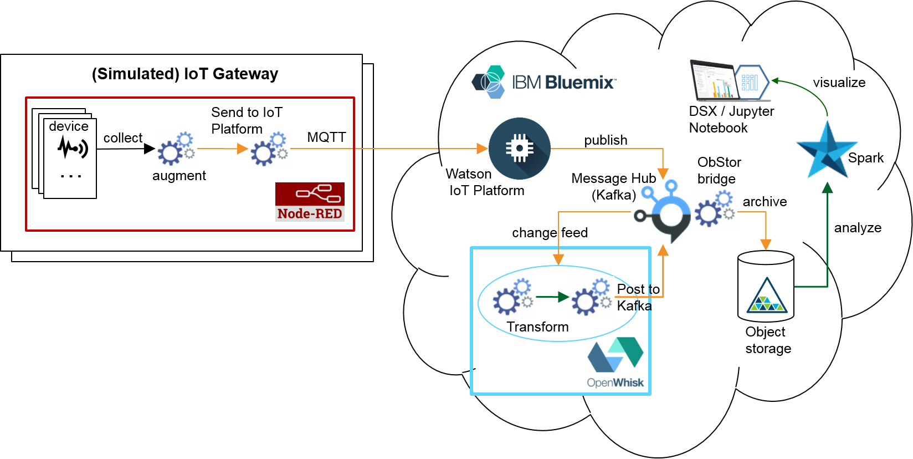

<!--
#
# Licensed to the Apache Software Foundation (ASF) under one or more
# contributor license agreements.  See the NOTICE file distributed with
# this work for additional information regarding copyright ownership.
# The ASF licenses this file to You under the Apache License, Version 2.0
# (the "License"); you may not use this file except in compliance with
# the License.  You may obtain a copy of the License at
#
#     http://www.apache.org/licenses/LICENSE-2.0
#
# Unless required by applicable law or agreed to in writing, software
# distributed under the License is distributed on an "AS IS" BASIS,
# WITHOUT WARRANTIES OR CONDITIONS OF ANY KIND, either express or implied.
# See the License for the specific language governing permissions and
# limitations under the License.
#
-->
# Common use cases

The execution model that is offered by OpenWhisk supports a variety of use cases. The following sections include typical examples. For a more detailed discussion of Serverless architecture, example uses cases, pros and cons discussion and implementation best practices, please read excellent [Mike Roberts article on Martin Fowler's blog](https://martinfowler.com/articles/serverless.html).

## Microservices

Despite their benefit, microservice-based solutions remain difficult to build using mainstream cloud technologies, often requiring control of a complex toolchain, and separate build and operations pipelines. Small and agile teams, spending too much time dealing with infrastructural and operational complexities (fault-tolerance, load balancing, auto-scaling, and logging), especially want a way to develop streamlined, value-adding code with programming languages they already know and love and that are best suited to solve particular problems.

The modular and inherently scalable nature of OpenWhisk makes it ideal for implementing granular pieces of logic in actions. OpenWhisk actions are independent of each other and can be implemented using variety of different languages supported by OpenWhisk and access various backend systems. Each action can be independently deployed and managed, is scaled independently of other actions. Interconnectivity between actions is provided by OpenWhisk in the form of rules, sequences and naming conventions. This bodes well for microservices based applications.

## Web apps

Even though OpenWhisk was originally designed for event based programming, it offers several benefits for user-facing applications. For example, when you combine it with a small Node.js stub, you can use it to serve applications that are relatively easy to debug. And because OpenWhisk applications are a lot less computationally intensive than running a server process on a PaaS platform, they are considerably cheaper, as well.

Full web applications can be built and run with OpenWhisk. Combining serverless APIs with static file hosting for site resources, e.g. HTML, JavaScript and CSS, means we can build entire serverless web applications. The simplicity of operating a hosted OpenWhisk environment (or rather not having to operate anything at all since it is hosted on IBM Cloud) is a great benefit compared to standing up and operating a Node.js Express or other traditional server runtime.

One of the things that helps is the option of OpenWhisk CLI *wsk* tool called "--annotation web-export true", which makes the code accessible from a web browser.

Here are few examples on how to use OpenWhisk to build a web app:
- [Web Actions: Serverless Web Apps with OpenWhisk](https://medium.com/openwhisk/web-actions-serverless-web-apps-with-openwhisk-f21db459f9ba).
- [Build a user-facing OpenWhisk application with IBM Cloud Functions and Node.js](https://www.ibm.com/developerworks/cloud/library/cl-openwhisk-node-bluemix-user-facing-app/index.html)
- [Serverless HTTP handlers with OpenWhisk](https://medium.com/openwhisk/serverless-http-handlers-with-openwhisk-90a986cc7cdd)

## IoT

It is certainly possible to implement IoT applications using traditional server architectures, however in many cases the combination of different services and data bridges requires high performance and flexible pipelines, spanning from IoT devices up to cloud storage and an analytics platform. Often pre-configured bridges lack the programmability required to implement and fine-tune a particular solution architecture. Given the huge variety of possible pipelines and the lack of standardization around data fusion in general and in IoT in particular, there are many cases where the pipeline requires custom data transformation (for format conversion, filtering, augmentation, etc). OpenWhisk is an excellent tool to implement such a transformation, in a ‘serverless’ manner, where the custom logic is hosted on a fully managed and elastic cloud platform.

Internet of Things scenarios are often inherently sensor-driven. For example, an action in OpenWhisk might be triggered if there is a need to react to a sensor that is exceeding a particular temperature. IoT interactions are usually stateless with potential for very high level of load in case of major events (natural disasters, significant weather events, traffic jams, etc.) This creates a need for an elastic system where normal workload might be small, but needs to scale very quickly with predictable response time and ability to handle extremely large number of events with no prior warning to the system. It is very hard to build a system to meet these requirements using traditional server architectures as they tend to either be underpowered and unable to handle peak in traffic or be over-provisioned and extremely expensive.

Here is a sample IoT application that uses OpenWhisk, NodeRed, Cognitive and other services: [Serverless transformation of IoT data-in-motion with OpenWhisk](https://medium.com/openwhisk/serverless-transformation-of-iot-data-in-motion-with-openwhisk-272e36117d6c#.akt3ocjdt).

## API backend

Serverless computing platforms give developers a rapid way to build APIs without servers. OpenWhisk supports automatic generation of REST API for actions and it is very easy to connect your API Management tool of choice (such as [IBM API Connect](https://www-03.ibm.com/software/products/en/api-connect) or other) to these REST APIs provided by OpenWhisk. Similar to other use cases, all considerations for scalability, and other Qualities of Services (QoS) apply.

Here is an example and a discussion of [using Serverless as an API backend](https://martinfowler.com/articles/serverless.html#ACoupleOfExamples).

## Mobile back end

Many mobile applications require server-side logic. For mobile developers that don't want to manage server-side logic and would rather focus on the app that is running on the device or browser, using OpenWhisk as the server-side back end is a good solution. In addition, the built-in support for Swift allows developers to reuse their existing iOS programming skills. Mobile applications often have unpredictable load patterns and hosted OpenWhisk solution, such as IBM Cloud Functions, can scale to meet practically any demand in workload without the need to provision resources ahead of time.

## Data processing

With the amount of data now available, application development requires the ability to process new data, and potentially react to it. This requirement includes processing both structured database records as well as unstructured documents, images, or videos. OpenWhisk can be configured via system provided or custom feeds to react to changes in data and automatically execute actions on the incoming feeds of data. Actions can be programmed to process changes, transform data formats, send and receive messages, invoke other actions, update various data stores, including SQL based relational databases, in-memory data grids, NoSQL database, files, messaging brokers and variety of other systems. OpenWhisk rules and sequences provide flexibility to make changes in processing pipeline without programming - simply via configuration changes. This makes OpenWhisk based system highly agile and easily adaptable to changing requirements.

## Cognitive

Cognitive technologies can be effectively combined with OpenWhisk to create powerful applications. For example, IBM Alchemy API and Watson Visual Recognition can be used with OpenWhisk to automatically extract useful information from videos without having to actually watch them.

Here is a sample application [Dark vision](https://github.com/IBM-Cloud/openwhisk-darkvisionapp) that does just that. In this application the user uploads a video or image using the Dark Vision web application, which stores it in a Cloudant DB. Once the video is uploaded, OpenWhisk detects the new video by listening to Cloudant changes (trigger). OpenWhisk then triggers the video extractor action. During its execution, the extractor produces frames (images) and stores them in Cloudant. The frames are then processed using Watson Visual Recognition and the results are stored in the same Cloudant DB. The results can be viewed using Dark Vision web application OR an iOS application. Object Storage can be used in addition to Cloudant. When doing so, video and image medadata are stored in Cloudant and the media files are stored in Object Storage.
